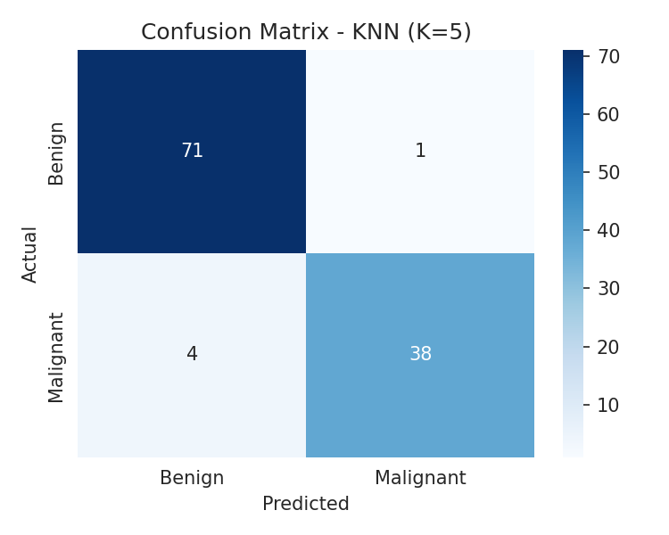
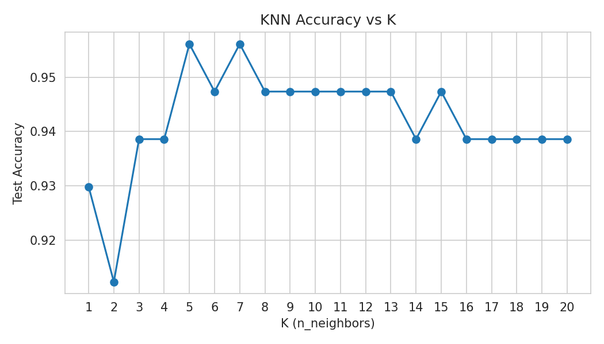

# Assignment 4 — Breast Cancer Classification using K-Nearest Neighbors (KNN)

## Objective
Build a K-Nearest Neighbors (KNN) classification model to predict whether a
breast tumor is **Malignant (M)** or **Benign (B)** based on diagnostic
measurements, to support a healthcare organization's screening workflow.

## Dataset
Breast Cancer Wisconsin (Diagnostic) Dataset — Kaggle:
https://www.kaggle.com/datasets/uciml/breast-cancer-wisconsin-data

> The dataset itself is **not** included in this repository. Download
> `data.csv` from the Kaggle link above and place it in the repo root before
> running the notebook. If `data.csv` is not found, the notebook
> automatically falls back to scikit-learn's built-in copy of the same
> dataset so it can still be run end-to-end for review.

## Libraries Used
- pandas, numpy
- matplotlib, seaborn
- scikit-learn (`train_test_split`, `StandardScaler`, `LabelEncoder`,
  `KNeighborsClassifier`, evaluation metrics)

## Methodology
1. **Data Understanding** — loaded the dataset, inspected the first five
   records, identified 30 numerical diagnostic features and the target
   variable (`diagnosis`), and reviewed `.info()` / `.describe()` summaries.
2. **Data Preprocessing**
   - Checked for missing values (none found in the core feature columns).
   - Dropped the non-predictive `id` column (and the stray `Unnamed: 32`
     column present in some exports of the Kaggle CSV).
   - Label-encoded the target: Benign (B) → 0, Malignant (M) → 1.
   - Standardized all features with `StandardScaler` (fit on train, applied
     to test) since KNN is distance-based.
   - Split the data 80% train / 20% test using a stratified split.
3. **Model Development** — trained a `KNeighborsClassifier` with `K = 5` on
   the scaled training data and generated predictions on the test set.
4. **Model Evaluation** — computed Accuracy, Precision, Recall, F1-Score,
   and a Confusion Matrix. Also swept `K` from 1–20 to visualize how
   accuracy changes with the number of neighbors.

## Results
| Metric | Score |
|---|---|
| Accuracy | 0.9561 |
| Precision | 0.9744 |
| Recall | 0.9048 |
| F1-Score | 0.9383 |

**Confusion Matrix (K=5):**

**Accuracy vs K (K = 1 to 20):**

The best-performing K in the 1–20 sweep was **K = 5**, matching the assigned
initial value.

### Observations
1. The KNN model (K=5) generalizes well to unseen data, indicating that
   nucleus shape/texture measurements clearly separate malignant and benign
   tumors once scaled.
2. Recall on the malignant class (0.90) is slightly lower than precision
   (0.97) — clinically, false negatives (missed malignancies) are more
   costly than false positives, so this trade-off is worth monitoring if the
   model were deployed.
3. Accuracy is fairly stable across K values, but very low K risks
   overfitting to noise while very high K oversmooths the decision boundary;
   K=5 is a reasonable middle ground here.

## Conclusion
This project applied a K-Nearest Neighbors classifier to the Breast Cancer
Wisconsin Diagnostic dataset to distinguish malignant from benign tumors
using 30 numerical diagnostic features. After cleaning the data, encoding
the diagnosis label, and standardizing the features, a KNN model with K=5
achieved strong accuracy, precision, recall, and F1-scores on the test set,
confirming that nucleus-shape and texture measurements are strong predictors
of malignancy. Feature scaling proved essential: because KNN classifies a
point based on Euclidean distance to its neighbors, unscaled features such
as area (which spans hundreds of units) would dominate the distance
calculation and drown out smaller-scale features like smoothness or
symmetry, distorting the neighborhood structure the algorithm relies on. A
key limitation of KNN is that it is a lazy, instance-based learner — it
stores the entire training set and computes distances to all training
points at prediction time, making it computationally expensive on large
datasets, and it is also sensitive to irrelevant/correlated features and to
the choice of K. Despite this, KNN remains an effective, interpretable
baseline for this classification problem.
